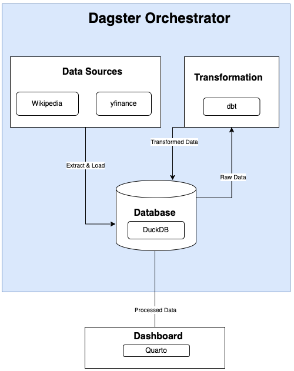
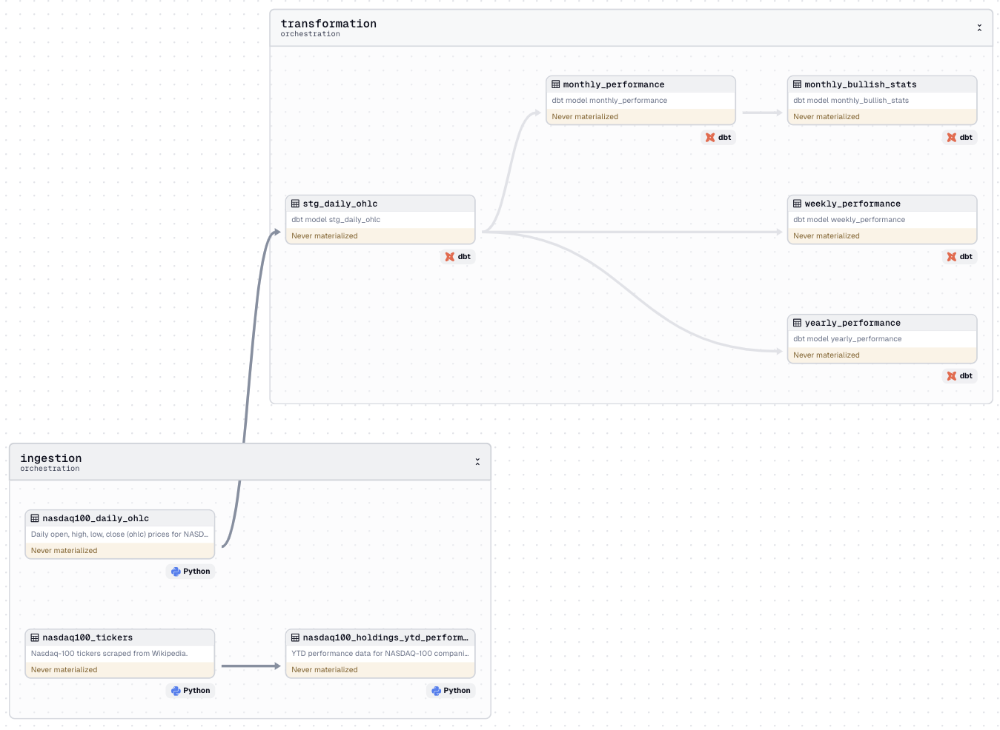

# Nasdaq-100 Index ELT

## About
This project is designed to extract, load, transform (ELT), and visualize data from the Nasdaq-100 index. It serves as an end-to-end data pipeline demonstration, leveraging Python, Dagster, dbt, and Quarto. The primary goal is to gain practical experience with Modern Data Stack technologies while analyzing financial data.

The project does the following things:

1. __Data Scraping__: Scrapes [wikipedia](https://en.wikipedia.org/wiki/Nasdaq-100) for a list of comapnies in the Nasdaq100.
2. __Data Extraction__: Uses `yfinace` python package to get information on companies in the Nasdaq-100 along with the daily open, high, low and close prices (OHLC) for the Nasdaq-100 E-mini futures (NQ). This data is then loaded to a DuckDB database for further processing.
4. __Data Transformation__: Uses dbt to to transform the daily OHLC data, calculating weekly, monthly, and yearly returns.
5. __Data Visualization__: Uses Quarto to create this [dashboard](link-to-dashboard)


## Architecture

<p align="center" width="100%">
  
</p>

## Pipeline DAG

<p align="center" width="100%">
  
</p>

## Prerequisites
Berfore starting ensure that Python is installed on your system. All development for this project was performed in Visual Studio Code (VSCode).

## Setup

To get started with this project:

1. __Create a virtual environment__

```bash
python3 -m venv .venv
source .venv/bin/activate
```

2. __Install Dependencies__

For pipeline only setup:
```bash
pip install -e ".[dev]"
```

For both pipeline and dashboard setup:
```bash
pip install -e ".[dev,dashboard]"
```
Note: VS code users should also install the [VS Code extension for Quarto](https://marketplace.visualstudio.com/items?itemName=quarto.quarto) to render and preview the Quarto dashboard. 

## Using Dagster
To launch the Dagster UI web server, run `dagster dev` from the root directory and then navigate to the port shown in your console to view and interact with the pipeline.

